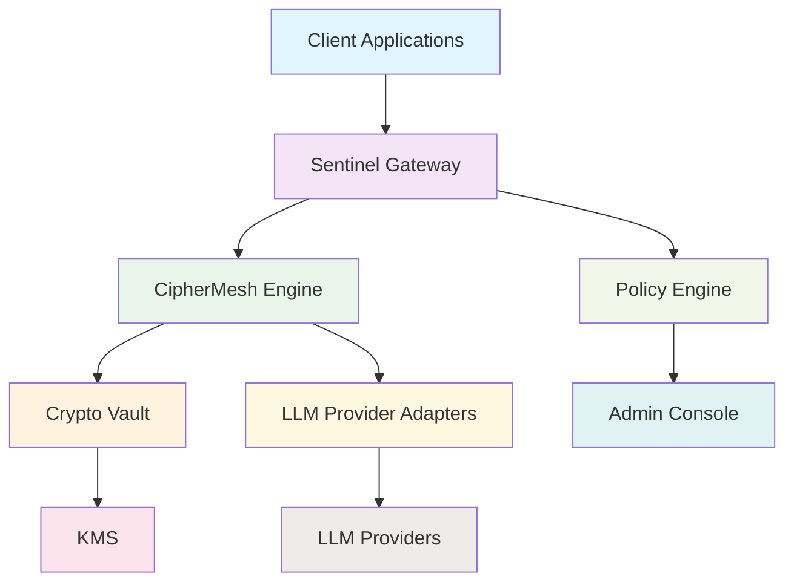
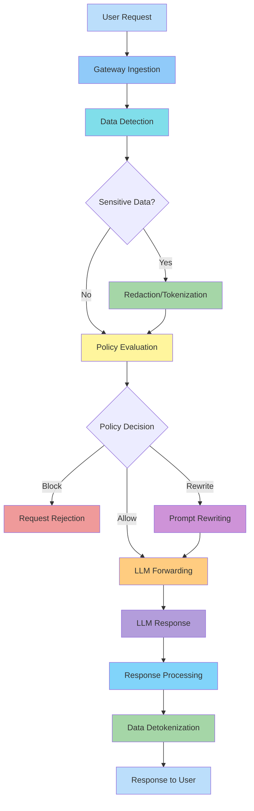
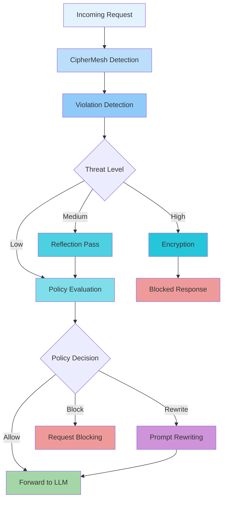
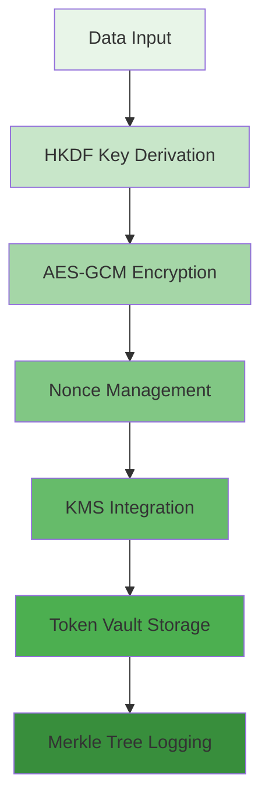
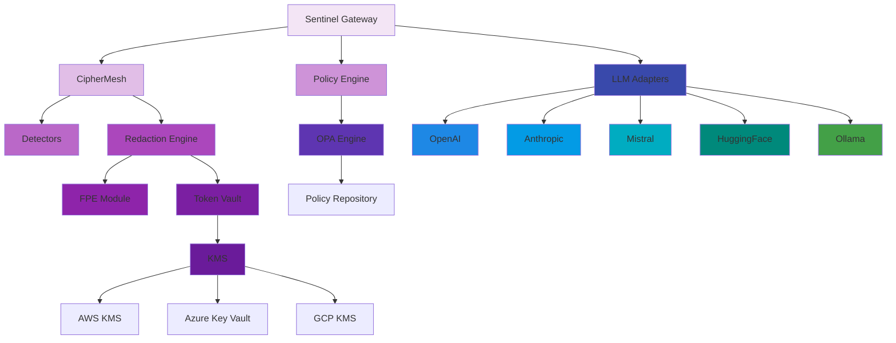

# Sentinel System Diagrams

## System Architecture

```mermaid
graph TB
    A[Client Applications] --> B[Sentinel Gateway]
    B --> C[CipherMesh Engine]
    C --> D[Crypto Vault]
    D --> E[KMS]
    B --> F[Policy Engine]
    F --> G[Admin Console]
    C --> H[LLM Provider Adapters]
    H --> I[LLM Providers]

    style A fill:#e1f5fe
    style B fill:#f3e5f5
    style C fill:#e8f5e8
    style D fill:#fff3e0
    style E fill:#fce4ec
    style F fill:#f1f8e9
    style G fill:#e0f2f1
    style H fill:#fff8e1
    style I fill:#efebe9
```

## Data Flow Diagram

```mermaid
graph TD
    A[User Request] --> B[Gateway Ingestion]
    B --> C[Data Detection]
    C --> D{Sensitive Data?}
    D -->|Yes| E[Redaction/Tokenization]
    D -->|No| F[Policy Evaluation]
    E --> F
    F --> G{Policy Decision}
    G -->|Allow| H[LLM Forwarding]
    G -->|Block| I[Request Rejection]
    G -->|Rewrite| J[Prompt Rewriting]
    J --> H
    H --> K[LLM Response]
    K --> L[Response Processing]
    L --> M[Data Detokenization]
    M --> N[Response to User]

    style A fill:#bbdefb
    style B fill:#90caf9
    style C fill:#80deea
    style E fill:#a5d6a7
    style F fill:#fff59d
    style H fill:#ffcc80
    style I fill:#ef9a9a
    style J fill:#ce93d8
    style K fill:#b39ddb
    style L fill:#81d4fa
    style M fill:#a5d6a7
    style N fill:#bbdefb
```

## Security Pipeline

```mermaid
graph TD
    A[Incoming Request] --> B[CipherMesh Detection]
    B --> C[Violation Detection]
    C --> D{Threat Level}
    D -->|Low| E[Policy Evaluation]
    D -->|Medium| F[Reflection Pass]
    D -->|High| G[Encryption]
    F --> E
    G --> H[Blocked Response]
    E --> I{Policy Decision}
    I -->|Allow| J[Forward to LLM]
    I -->|Rewrite| K[Prompt Rewriting]
    I -->|Block| L[Request Blocking]
    K --> J

    style A fill:#e3f2fd
    style B fill:#bbdefb
    style C fill:#90caf9
    style E fill:#80deea
    style F fill:#4dd0e1
    style G fill:#26c6da
    style H fill:#ef9a9a
    style J fill:#a5d6a7
    style K fill:#ce93d8
    style L fill:#ef9a9a
```

## Cryptographic Components

```mermaid
graph TD
    A[Data Input] --> B[HKDF Key Derivation]
    B --> C[AES-GCM Encryption]
    C --> D[Nonce Management]
    D --> E[KMS Integration]
    E --> F[Token Vault Storage]
    F --> G[Merkle Tree Logging]

    style A fill:#e8f5e8
    style B fill:#c8e6c9
    style C fill:#a5d6a7
    style D fill:#81c784
    style E fill:#66bb6a
    style F fill:#4caf50
    style G fill:#388e3c
```

## Component Interaction

```mermaid
graph TD
    A[Sentinel Gateway] --> B[CipherMesh]
    A --> C[Policy Engine]
    B --> D[Detectors]
    B --> E[Redaction Engine]
    E --> F[FPE Module]
    E --> G[Token Vault]
    G --> H[KMS]
    H --> I[AWS KMS]
    H --> J[Azure Key Vault]
    H --> K[GCP KMS]
    C --> L[OPA Engine]
    L --> M[Policy Repository]
    A --> N[LLM Adapters]
    N --> O[OpenAI]
    N --> P[Anthropic]
    N --> Q[Mistral]
    N --> R[HuggingFace]
    N --> S[Ollama]

    style A fill:#f3e5f5
    style B fill:#e1bee7
    style C fill:#ce93d8
    style D fill:#ba68c8
    style E fill:#ab47bc
    style F fill:#8e24aa
    style G fill:#7b1fa2
    style H fill:#6a1b9a
    style L fill:#5e35b1
    style N fill:#3949ab
    style O fill:#1e88e5
    style P fill:#039be5
    style Q fill:#00acc1
    style R fill:#00897b
    style S fill:#43a047
```
